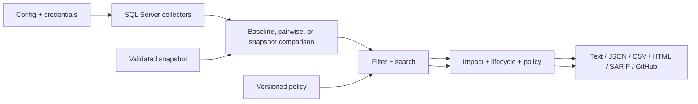

# Architecture overview

Driftwatch is a single-process Python CLI. It loads configuration, collects
schema metadata from each SQL Server target, compares inventories into
`Finding` values, then applies policy, filters, and search before rendering
output. Snapshots enter the same inventory boundary as live collections.

Each inventory has an overall `SUCCESS`, `PARTIAL`, or `FAILED` status and
section statuses for objects, columns, indexes, constraints, and database
metadata. Specialized
differs produce property-level findings with expected/actual values and impact
severity. Failed sections are excluded from schema comparison.

The presentation layer is format-neutral: text, JSON, CSV, and SARIF all consume the
same selected findings. Aggregate analysis is computed from that same selection,
so counts and details cannot describe different result sets.

There is no persistent database, web service, queue, or implicit migration
writer. The tool operates in memory for one invocation; versioned schema
snapshots provide the durable Git contract, and controlled before/after
snapshots provide migration effects and file-based lifecycle history.

