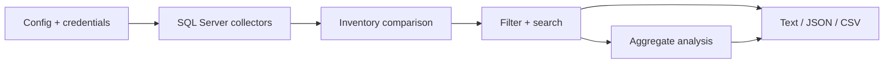

# Architecture overview

Driftwatch is a single-process Python CLI. It loads configuration, collects
schema metadata from each SQL Server target, compares inventories into
`Finding` values, then applies filters and search before rendering output.

The presentation layer is format-neutral: text, JSON, and CSV all consume the
same selected findings. Aggregate analysis is computed from that same selection,
so counts and details cannot describe different result sets.

There is no persistent database, web service, queue, or migration writer. The
tool operates in memory for one invocation; historical and cross-run analysis
are intentionally outside the current scope.

